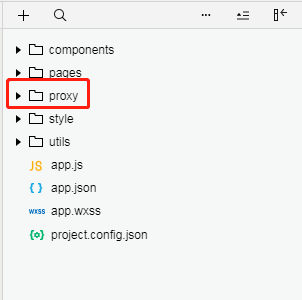
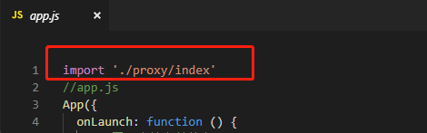

<h2>在项目引入jt-plugin</h2>

<h5>通过node安装</h5>

```
npm install jt-plugin
```

或者在github[下载](https://github.com/Jia-Tui/scaling-couscous)

---

<h5>下载后找到proxy目录，放到小程序项目的根目录</h5>


<h5>然后在app.js文件中引入proxy</h5>

