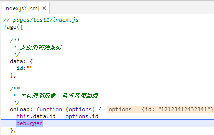
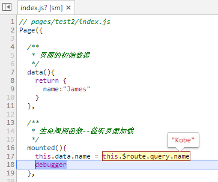
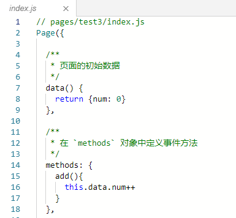
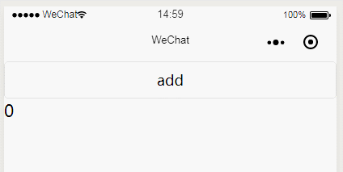

# 数据与方法
___

当app.js中引入proxy包后，原生小程序的Page和Component函数将被重写，这时并不会影响你之前的小程序。
只有当你按照我们规定的写法后，data对象才会被代理。

<h4>例子：</h4>
<b>兼容小程序原生写法：</b>你在data里声明一个id变量，onLoad函数通过options获取参数，小程序的生命周期还是和以前一样的写法。

<h3>jt-plugin写法</h3>

# data

data不再是一个属性，而是通过函数返回一个对象，初始化过程中，你可以对data对象做一些简单的处理。同时，这样每一个组件或者页面实例的data属性都是独立的，不会相互影响了。

mounted将代替onLoad函数，参数信息已经为你保存在$route里了，用法请参考[vue](https://cn.vuejs.org/v2/guide/migration-vue-router.html#URL-%E4%B8%AD%E7%9A%84-Query-%E6%95%B0%E7%BB%84-%E8%AF%AD%E6%B3%95-%E7%A7%BB%E9%99%A4) 的写法

# methods

methods用于绑定页面中的事件，方法中的this自动绑定为小程序的实例。

