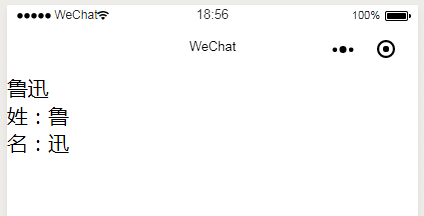
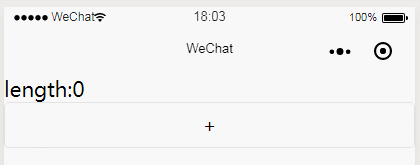

# 深入

# 计算属性
未完成

# 侦听器

通过 watch 选项提供了一个通用的方法，来响应数据的变化。当需要在数据变化时执行异步或开销较大的操作时，这个方式是最有用的。

<h6>例如：</h6>

```
Page({
  data(){
    return {
      name:"鲁迅",
      firstName:"",
      lastName:"",
    }
  },
  watch:{
    name(newVal){
      this.data.firstName = newVal.substr(0,1)
      this.data.lastName = newVal.substr(1)
    }
  },
})
```


```
<input class="test" bindinput="bindKeyInput" data-key="name" value="{{name}}"/>
<view >姓：{{firstName}}</view>
<view >名：{{lastName}}</view>
```

<h6>结果：</h6>




# 混入

<h4>基础</h4>

混入 (mixins) 是一种分发组件中可复用功能的非常灵活的方式。
混入对象可以包含任意组件选项。当组件使用混入对象时，所有混入对象的选项将被混入该组件本身的选项。
小程序本身已经实现混入功能（behaviors），但只适用于组件。page并不能使用，mixins本身与behaviors没有冲突，并没有重写behaviors，而是重载了自己的实现。

<h6>例子：</h6>

* 在mixins目录下新建card.js文件
```
// 定义一个混入对象
export default {
    data(){
        return {
            length:0
        }
    },
    methods:{
        addOne(){
            this.data.length = this.data.length+1
        }
    }
}
```

* 在page页面引入mixins文件，并混入到Page中

```
import card from "../../mixins/card"

Page({
  mixins: [card],
})
```

* 在wxml中绑定混入对象的值和事件

```
<view >length:{{length}}</view>
<button class="default" bind:tap="addOne">+</button>

```




<h4>选项合并</h4>

* 当组件和混入对象含有同名选项时，这些选项将以恰当的方式混合。

比如，数据对象在内部会进行浅合并 (一层属性深度)，在和组件的数据发生冲突时以组件数据优先。

* 同名钩子函数将混合为一个数组，因此都将被调用。另外，混入对象的钩子将在组件自身钩子之前调用。

* 值为对象的选项，例如 methods, components 和 directives，将被混合为同一个对象。两个对象键名冲突时，取组件对象的键值对。